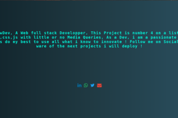

# STS_SmokeAnimation

**STS_SmokeAnimation** est une animation interactive et dynamique de texte qui crée un effet de fumée lorsque l'utilisateur survole les lettres avec la souris. Ce projet est conçu pour les développeurs passionnés qui souhaitent intégrer des animations créatives dans leurs projets web.

## Fonctionnalités
- Animation fluide et personnalisable pour chaque lettre.
- Effet de fumée qui disparaît avec des transformations (rotation, flou, mise à l'échelle).
- Facile à intégrer dans vos projets HTML/CSS/JavaScript.
- Thème moderne et dynamique.

## Aperçu
 <!-- Remplacez par une vraie image si disponible -->

## Technologies utilisées
- **HTML** : Structure de la page.
- **CSS** : Styles et animations.
- **JavaScript** : Manipulation dynamique du DOM pour l'effet interactif.

## Installation
1. Clonez le dépôt GitHub :
   ```bash
   git clone https://github.com/Dimitri-Tedom/STS_HoverSmoke.git
   ```
2. Ouvrez le fichier `index.html` dans votre navigateur pour visualiser le projet.

## Comment ça marche ?
Le projet découpe chaque lettre du texte en `<span>` à l'aide de JavaScript, ce qui permet de déclencher des animations individuelles pour chaque lettre lorsqu'elle est survolée par la souris. Les animations sont définies en CSS avec `@keyframes`.

## Auteur
- **Nom** : Dimitri Tedom Tafotsi Wilfried
- **Gmail** : [dimitritedom@gmail.com](mailto:dimitritedom@gmail.com)
- **LinkedIn** : [Dimitri Tedom Tafotsi Wilfried](https://www.linkedin.com/in/tedom-tafotsi-dimitri-wilfried-b70502298/)
- **Twitter** : [@DimitriTedom](https://x.com/DimitriTedom)
- **WhatsApp** : +237 695760594

## Contribution
Les contributions sont les bienvenues !

1. Forkez le projet.
2. Créez une branche pour vos modifications :
   ```bash
   git checkout -b feature/nom_de_votre_fonctionnalite
   ```
3. Soumettez une pull request.

## Licence
Ce projet est sous licence MIT. Vous êtes libre de l'utiliser et de le modifier.

## Contact
Pour toute question ou suggestion, n'hésitez pas à me contacter via les plateformes ci-dessus.

